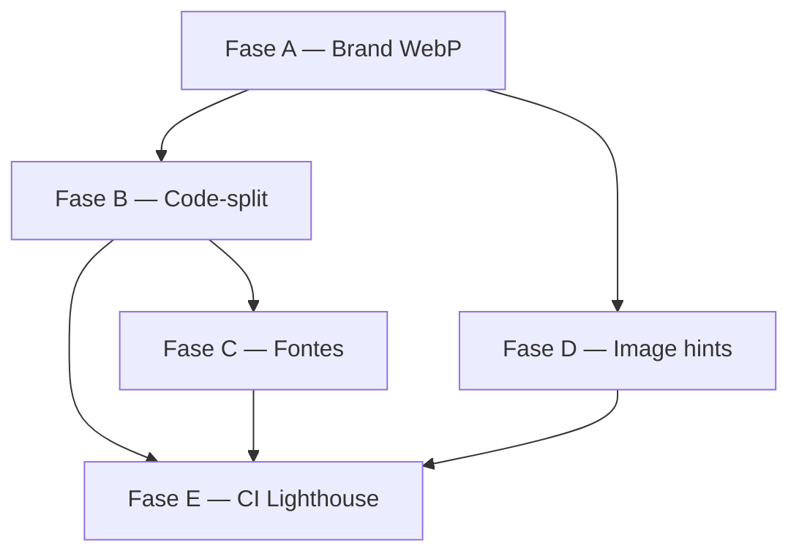

# Plano de Performance — Aprovingo Frontend

> **Epic:** EPIC-8 (critério pendente: Lighthouse Performance ≥ 85)  
> **Baseline:** 2026-07-10 · preview local `:4173` · mobile 375px  
> **Responsável sugerido:** @dev + @qa

---

## 1. Diagnóstico (baseline)

| Métrica | Login | Dashboard | Meta EPIC-8 |
|---------|-------|-----------|-------------|
| Performance | 61 → 67* | 55 → 58* | ≥ 85 |
| Accessibility | 90–91 | 96 | ≥ 90 ✅ |
| LCP | 22.6s → 5.3s* | 17.9s → 6.2s* | < 2.5s (ideal) |

\* Com WebP otimizado; **com SVG originais** (`logo2.svg` ~3,4 MB + `aprovinho.svg` ~1,4 MB) o LCP tende a regredir.

| Asset / bundle | Tamanho (prod) | Impacto |
|----------------|----------------|---------|
| `logo2.svg` | 3,4 MB (gzip ~2,5 MB) | LCP login/sidebar |
| `aprovinho.svg` | 1,4 MB (gzip ~986 KB) | LCP auth hero |
| `index.js` | ~1,84 MB (gzip ~529 KB) | FCP, TBT, TTI |
| `index.css` | ~128 KB (gzip ~20 KB) | Baixo |

**Causa raiz:** SVGs são PNG base64 embutidos (não vetoriais reais). O bundle JS monolítico carrega TipTap, Recharts, Flashcards e admin num único chunk.

---

## 2. Objetivos

| Fase | Meta | Prazo sugerido |
|------|------|----------------|
| **P0** | LCP login/dashboard < 3s (preview prod) | 1 sprint |
| **P1** | Lighthouse Performance ≥ 85 (mobile) | 1–2 sprints |
| **P2** | Manter bundle inicial < 250 KB gzip (rota crítica) | contínuo |

**Restrição:** preservar aparência original da logo e mascote (decisão PO: SVGs fonte mantidos).

---

## 3. Fases de implementação

### Fase A — Assets de marca (impacto LCP: **alto**)

**Problema:** PNG raster dentro de SVG infla o payload sem benefício de escala vetorial.

**Solução recomendada (sem perder identidade visual):**

1. **Extrair PNG fonte** dos SVGs atuais (script one-shot, não commitar PNG bruto se > 100 KB).
2. Gerar **WebP/AVIF** em resoluções fixas:
   - Logo sidebar: `440×121` WebP (~4 KB), roxo brand + alpha
   - Logo auth (branca): mesma máscara + `brightness-0 invert` no hero **ou** variante `logo-white.webp`
   - Mascote hero: `720×394` WebP (~15–40 KB)
3. Manter `logo2.svg` / `aprovinho.svg` no repo como **fonte** (não importados no runtime).
4. Adicionar `<link rel="preload" as="image">` só na rota auth para logo + mascote.

```tsx
// AprovingoLogo.tsx — runtime
import logoSrc from "@/assets/brand/logo2.webp";
// src/assets/brand/logo2.svg permanece como fonte de design
```

**Alternativa conservadora:** servir SVGs via CDN com `Cache-Control: immutable` + compressão Brotli (ainda ~4 MB na primeira visita — insuficiente para meta 85).

**Esforço:** ~4h dev + validação visual PO.

---

### Fase B — Code-splitting por rota (impacto TBT/FCP: **alto**)

**Estado atual:** um chunk `index-*.js` ~529 KB gzip.

**Ações:**

1. **`React.lazy` + `Suspense`** em `App.tsx` para rotas não críticas:

| Rota / módulo | Prioridade lazy |
|---------------|-----------------|
| `/flashcards/*` | Alta (TipTap + DnD) |
| `/admin/*` | Alta |
| `/concursos/planos/:id` | Média |
| `/pomodoro`, `/calendario` | Média |
| Login, Dashboard | **Eager** (critical path) |

2. **`manualChunks` no Vite** (`vite.config.ts`):

```ts
build: {
  rollupOptions: {
    output: {
      manualChunks: {
        vendor: ["react", "react-dom", "react-router-dom"],
        query: ["@tanstack/react-query"],
        charts: ["recharts"],
        editor: ["@tiptap/react", "@tiptap/starter-kit", /* extensões */],
      },
    },
  },
},
```

3. **FlashcardsPage:** import dinâmico de `RichTextEditor` só ao abrir modal de card.

**Meta:** chunk inicial ≤ 280 KB gzip; TipTap/Recharts só após navegação.

**Esforço:** ~1–2 dias dev + smoke E2E.

---

### Fase C — Fontes (impacto FCP: **médio**)

Geist Variable já via `@fontsource-variable/geist`.

- Confirmar **`font-display: swap`** (Fontsource default).
- Preload apenas **`geist-latin-wght-normal`** (~28 KB) no `index.html`.
- Remover famílias não usadas (`DM Serif`, `DM Sans`, `JetBrains Mono`) se não houver uso em produção.

**Esforço:** ~2h.

---

### Fase D — Imagens e mídia (impacto LCP/CLS: **médio**)

- `width` / `height` explícitos em logo e mascote (já parcialmente feito).
- `fetchPriority="high"` só no LCP element por rota (sidebar logo **ou** auth hero, não ambos na mesma paint).
- Lazy load mascote mobile (`loading="lazy"`) — hero desktop mantém eager.
- Revisar uploads TipTap: limite de dimensão no backend + thumbnail WebP.

**Esforço:** ~3h.

---

### Fase E — CI e monitoramento (impacto processo: **médio**)

1. Script existente: `npm run lh:dashboard` (preview `:4173` + seed auth).
2. Adicionar job CI (GitHub Actions):
   - `npm run build && vite preview --port 4173`
   - Lighthouse mobile login + dashboard autenticado
   - Falhar se Performance < 85 ou A11y < 90
3. Artefato: `docs/lighthouse/summary.json` atualizado por PR.

**Esforço:** ~4h DevOps.

---

## 4. Ordem de execução recomendada



**Quick win estimado (só Fase A):** Performance 55 → ~70–75.  
**Meta 85:** requer Fase A + B (mínimo).

---

## 5. Critérios de aceite

- [ ] Lighthouse mobile (375px, preview prod) Login ≥ 85 Performance
- [ ] Lighthouse mobile Dashboard autenticado ≥ 85 Performance
- [ ] LCP < 3s em ambas as rotas (preview local)
- [ ] Zero regressão visual logo/mascote (aprovação PO)
- [ ] `npm run build`, `typecheck`, `check:design-tokens` passando
- [ ] Smoke: login → dashboard → flashcards → disciplinas

---

## 6. Riscos

| Risco | Mitigação |
|-------|-----------|
| WebP da logo com cor errada (incidente anterior) | Pipeline `logoMaskToBrandWebp` com teste visual + pixel assert |
| Lazy route flash causa flash de loading | Skeleton por rota no `Suspense` fallback |
| CI Lighthouse instável | 3 runs median; threshold 82 + warning 85 |
| PO exige SVG no runtime | CDN + preload; aceitar Performance ~65–70 |

---

## 7. Fora de escopo (por ora)

- SSR / RSC (Next.js migration)
- Service Worker / offline
- Subset TipTap (remover extensões não usadas) — avaliar na Fase B
- Remoção de `mascote.svg` legado (~1,3 MB não referenciado) — cleanup seguro

---

## File List

- `front/concursoflow-front/docs/performance-plan.md` (este arquivo)
- Referência baseline: `docs/lighthouse/summary.json`
